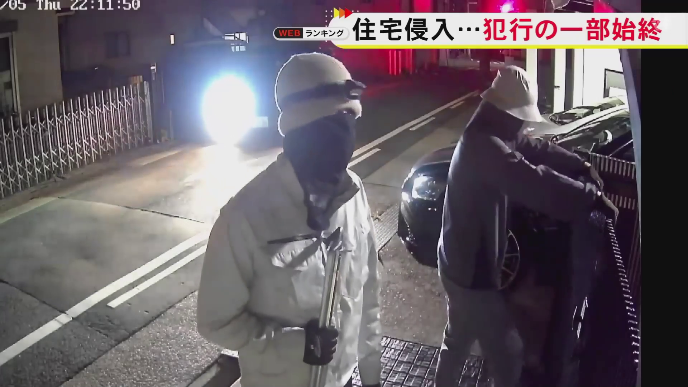
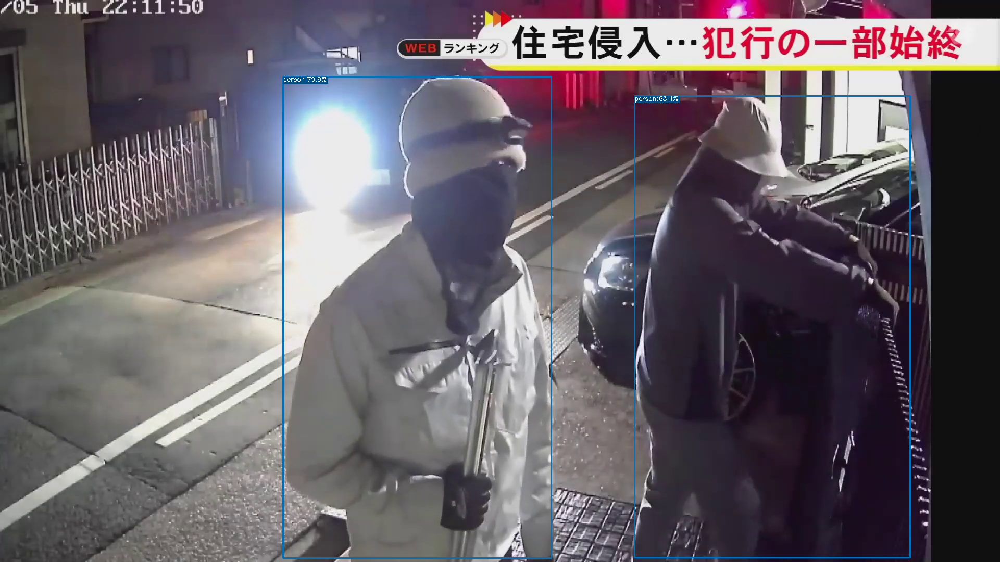
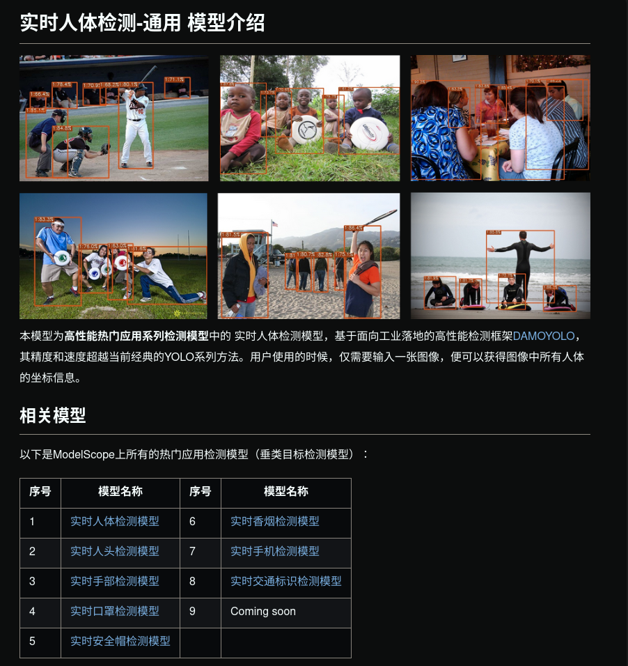

## はじめに
首都圏を中心に強盗事件が多くなり、防犯カメラを購入される世帯が増えているそうです。

そこでこのシリーズでは、防犯カメラに必要な技術、具体的には動体検知に関する技術の解説と実装に取り組みました。

この記事は[防犯カメラの動体検知を実装する①](https://zenn.dev/ykesamaru/articles/6fa5bf4cfc38b6)の第二弾となります。

防犯カメラの動体検知を実装する①では、枯れた技術（Contour Detection with Area Filtering）である画像処理を用いて、ラズベリーパイでも動作可能な動体検知システムを構築しました。

とはいえ、最低限、動体検知機能とは主に以下の3つの機能をカバーしています。

1. 画面上のピクセルの変化をどのように感知するか「検出方法」
2. 動体検知の感度を調整可能な「感度調整」
3. 動体検知の対象となる領域（検知範囲）を指定する「マスキング」

この記事では、最新のAI技術を用いて動体検知を行います。具体的にはDAMO-YOLOについて解説・実装していきます。


## 動作環境
```bash
(venv) user@user:~/ドキュメント/Motion_Detection$ inxi -SG --filter
System:
  Kernel: 6.8.0-48-generic x86_64 bits: 64 Desktop: GNOME 42.9
    Distro: Ubuntu 22.04.5 LTS (Jammy Jellyfish)
Graphics:
  Device-1: NVIDIA TU116 [GeForce GTX 1660 Ti] driver: nvidia v: 555.42.06
  Display: x11 server: X.Org v: 1.21.1.4 driver: X: loaded: nvidia
    unloaded: fbdev,modesetting,nouveau,vesa gpu: nvidia
    resolution: 2560x1440~60Hz
  OpenGL: renderer: NVIDIA GeForce GTX 1660 Ti/PCIe/SSE2
    v: 4.6.0 NVIDIA 555.42.06

(venv) user@user:~/ドキュメント/Motion_Detection$ python -V
Python 3.10.12

```


### 入力用動画ファイル
[「コラー！」で追い払う…住人は侵入者による被害をなぜ食い止められたのか 専門家が勧める“攻めの防犯”](https://www.youtube.com/watch?v=ZtQw5E3PA5c)

上記動画をinput.mp4としました。

## DAMO-YOLOについて
これまでわたしの記事ではいくつかの人体検知について記事にしてきました。
- [人物抽出のためのコード比較その①: OpenCV, MediaPipe, DeepLabV3](https://zenn.dev/ykesamaru/articles/e0380990465d34)
- [人物抽出のためのコード比較その②: YOLOv5, SORT](https://zenn.dev/ykesamaru/articles/6cb451f8fd1740)
- [人物抽出のためのコード比較その③: Deep OC-SORT](https://zenn.dev/ykesamaru/articles/36ff6507616e9b)
- [人物抽出のためのコード比較その④: DBSCAN, SSD](https://zenn.dev/ykesamaru/articles/4084a7074f3fe2)
- [人物抽出のためのコード比較その④-2: GPUを使ったSSD](https://zenn.dev/ykesamaru/articles/19254239bd3a6a)

上記それぞれを実際に実装した感想として、`YOLOv5`の性能が若干良いと感じました。

しかしながら`YOLOv5`はライセンス的に使い勝手がよくありません。

以下に、主要なYOLO系モデルとそのライセンス情報をまとめます。

| モデル名     | 公開年 | ライセンス | 商用利用可否 | リポジトリURL |
|--------------|--------|------------|--------------|----------------|
| YOLOv5       | 2020   | GPL        | 不可         | [https://github.com/ultralytics/yolov5](https://github.com/ultralytics/yolov5) |
| YOLOv6       | 2022   | GPL        | 不可         | [https://github.com/meituan/YOLOv6](https://github.com/meituan/YOLOv6) |
| YOLOv7       | 2022   | GPL        | 不可         | [https://github.com/WongKinYiu/yolov7](https://github.com/WongKinYiu/yolov7) |
| YOLOv8       | 2023   | AGPL       | 不可         | [https://github.com/ultralytics/ultralytics](https://github.com/ultralytics/ultralytics) |
| YOLOX        | 2021   | Apache 2.0 | 可能         | [https://github.com/Megvii-BaseDetection/YOLOX](https://github.com/Megvii-BaseDetection/YOLOX) |
| PP-YOLOE     | 2022   | Apache 2.0 | 可能         | [https://github.com/PaddlePaddle/PaddleDetection](https://github.com/PaddlePaddle/PaddleDetection) |
| DAMO-YOLO    | 2023   | Apache 2.0 | 可能         | [https://github.com/tinyvision/DAMO-YOLO](https://github.com/tinyvision/DAMO-YOLO) |
| YOLO-NAS     | 2023   | カスタム   | 要確認       | [https://github.com/Deci-AI/super-gradients](https://github.com/Deci-AI/super-gradients) |

最も新しく、かつライセンス的に良いのは`DAMO-YOLO`であることがわかりました。

`DAMO-YOLO`は一般的な物体検出モデルであり、人体の動体検知に特化しているわけではありませんが、防犯カメラに十分使えそうです。
またカスタムデータセットを作成してモデルのファインチューニングも可能です。たとえば手にバールを持っている人物だけを検知する、なんてことも可能です。

## 実装
### リポジトリ
DAMO-YOLO
https://github.com/tinyvision/DAMO-YOLO?tab=readme-ov-file

### 学習済みモデルの選定
わたしの環境、すなわちGTX 1660 Ti（6GB VRAM）環境でDAMO-YOLOを実行するため、学習済みモデルの選定を行います。

DAMO-YOLOには、以下のようなモデルが提供されています。

| モデル名           | パラメータ数 | 推論速度 (ms) | COCO AP (%) |
|--------------------|--------------|---------------|-------------|
| DAMO-YOLO-T        | 4.7M         | 2.8           | 40.0        |
| DAMO-YOLO-S        | 8.7M         | 3.8           | 43.0        |
| DAMO-YOLO-M        | 25.5M        | 5.6           | 46.8        |
| DAMO-YOLO-L        | 43.5M        | 7.6           | 49.0        |
| DAMO-YOLO-X        | 64.5M        | 9.8           | 50.0        |

DAMO-YOLO-Tがパラメータ数が少なく推論速度も速いので採用します。

### 実行環境構築

#### DAMO-YOLOのリポジトリをクローン
```bash
git clone https://github.com/tinyvision/DAMO-YOLO.git
cd DAMO-YOLO
```

#### Python仮想環境
今回は`DAMO-YOLO`ディレクトリ内に仮想環境を作成します。
```bash
python3 -m venv ./
```

#### 依存ライブラリのインストール
インストールにはしばらく時間がかかります。
```bash
pip install -r requirements.txt
pip install onnx onnx-simplifier onnxruntime
```

#### モジュールのインストール
DAMO-YOLOのディレクトリ内で以下のコマンドを実行し、必要なモジュールをインストールします。
`ModuleNotFoundError`が発生する場合は`damo`モジュールが仮想環境内にインストールされていない、ということなので、この処理が必要です。
```bash
pip install -e .
```

#### 学習済みモデルのダウンロード
```bash
mkdir -p pretrained_models
wget https://idstcv.oss-cn-zhangjiakou.aliyuncs.com/DAMO-YOLO/release_model/clean_model_0317/damoyolo_tinynasL20_T_420.pth -P pretrained_models/
```

<!-- #### Pythonパスの設定
DAMO-YOLOのルートディレクトリで実行。
```bash
export PYTHONPATH=$PYTHONPATH:$(pwd)
``` -->

#### オプションの確認
```bash
(venv) user@user:~/ドキュメント/Motion_Detection/DAMO-YOLO$ python tools/demo.py --help
usage: DAMO-YOLO Demo [-h] [-f CONFIG_FILE] [-p PATH] [--camid CAMID] [--engine ENGINE] [--device DEVICE] [--output_dir OUTPUT_DIR] [--conf CONF] [--infer_size INFER_SIZE [INFER_SIZE ...]]
                      [--end2end] [--save_result SAVE_RESULT]
                      input_type

positional arguments:
  input_type            input type, support [image, video, camera]

options:
  -h, --help            show this help message and exit
  -f CONFIG_FILE, --config_file CONFIG_FILE
                        pls input your config file
  -p PATH, --path PATH  path to image or video
  --camid CAMID         camera id, necessary when input_type is camera
  --engine ENGINE       engine for inference
  --device DEVICE       device used to inference
  --output_dir OUTPUT_DIR
                        where to save inference results
  --conf CONF           conf of visualization
  --infer_size INFER_SIZE [INFER_SIZE ...]
                        test img size
  --end2end             trt engine with nms
  --save_result SAVE_RESULT
                        whether save visualization results
```

#### OpenCVのエラー対処
OpenCV 4.9.0以降、Pythonでの動作においてNumPy配列が読み取り専用（readonly）として扱われる場合、`cv2.rectangle`や`cv2.circle`などの描画関数を使用するとエラーが発生するようになりました。

```bash
cv2.error: OpenCV(4.10.0) :-1: error: (-5:Bad argument) in function 'rectangle'
> Overload resolution failed:
>  - img marked as output argument, but provided NumPy array marked as readonly
>  - Expected Ptr<cv::UMat> for argument 'img'
```

これはこれらの関数が入力画像を直接変更しようとするため、読み取り専用の配列では操作が許可されないためです。

この変更を知らなかったため、ハマりました。

この変更は、[OpenCVの公式GitHubリポジトリのIssue](https://github.com/opencv/opencv/issues/24522)でも報告されています。

これを解決するため、以下のようにNumPy配列を連続したメモリブロックとしてコピーし、書き込み可能な状態にする必要があります。

```python
import numpy as np

# imgが読み取り専用のNumPy配列である場合
img = np.ascontiguousarray(img).copy()
```

具体的には`damo/utils/visualize.py`内の`vis関数`で、画像配列をコピーしてから処理するように変更します。

```diff: damo/utils/visualize.py
def vis(img, boxes, scores, cls_ids, conf=0.5, class_names=None):

+    # OpenCVでエラーが出ないように、imgを連続メモリとして扱えるようにする
+    img = np.ascontiguousarray(img).copy()

    for i in range(len(boxes)):
```

これで`img`は書き込み可能な配列となり、OpenCVの描画関数を正常に使用できるようになります。

#### 実行対象画像



#### 実行
#### 画像ファイル処理
```bash
(DAMO-YOLO) user@user:~/ドキュメント/Motion_Detection_YOLO/DAMO-YOLO$ python tools/demo.py image   -f ./configs/damoyolo_tinynasL20_T.py   --engine pretrained_models/damoyolo_tinynasL20_T_420.pth   --path assets/input.jpg   --conf 0.6   --save_result True   --device cpu   --infer_size 640 640

Inference with torch engine!
/home/user/ドキュメント/Motion_Detection_YOLO/DAMO-YOLO/tools/demo.py:75: FutureWarning: You are using `torch.load` with `weights_only=False` (the current default value), which uses the default pickle module implicitly. It is possible to construct malicious pickle data which will execute arbitrary code during unpickling (See https://github.com/pytorch/pytorch/blob/main/SECURITY.md#untrusted-models for more details). In a future release, the default value for `weights_only` will be flipped to `True`. This limits the functions that could be executed during unpickling. Arbitrary objects will no longer be allowed to be loaded via this mode unless they are explicitly allowlisted by the user via `torch.serialization.add_safe_globals`. We recommend you start setting `weights_only=True` for any use case where you don't have full control of the loaded file. Please open an issue on GitHub for any issues related to this experimental feature.
  ckpt = torch.load(self.ckpt_path, map_location=self.device)
save visualization results at ./demo/dog.jpg
```



#### 動画ファイル処理
`DAMO-YOLO`の強みはリアルタイム性です。ここでは用意したmp4ファイルを入力として`demo.py`に処理を投げます。

#### 一括処理
```bash
python tools/demo.py video \
  -f ./configs/damoyolo_tinynasL20_T.py \
  --engine pretrained_models/damoyolo_tinynasL20_T_420.pth \
  --path assets/input_1.mp4 \
  --conf 0.3 \
  --save_result True \
  --device cuda \
  --infer_size 640 640
```

この方法で`demo.py`を動作させると`demo/`ディレクトリに処理済みの動画ファイルが作成されます。

https://www.youtube.com/watch?v=upXQ8RjYVH4

#### リアルタイム処理
`demo.py`はリアルタイム処理を想定した処理が書かれていますが、`argparse`モジュールのブール型引数の扱いに誤りがあるため期待通りの動作になりません。[^1]
[^1]: （このようなリポジトリにありがち。学習済みモデルの`coming soon!`は絶対に追加されないし、メインの処理以外はバグで動かない。）

`argparse`モジュールのブール型引数の扱いが難しいのは、文字列の引数（例: `"True"` や `"False"`）をそのまま渡しても、`argparse`がそれをブール型に変換してくれないからです。

`argparse`では、ブール型の引数を扱うために、`action='store_true'` や `action='store_false'` を使う方法が推奨されています。この方法であれば引数が指定されているかどうかに応じて、`True` または `False` を簡単に設定できます。

```python
parser.add_argument('--save_result', action='store_true', help='whether to save visualization results')
parser.add_argument('--no_save_result', action='store_false', dest='save_result', help='do not save visualization results')
```

- `--save_result` が指定されていると `args.save_result` が `True` になります。
- `--no_save_result` が指定されていると `args.save_result` が `False` になります。

そこで`demo.py`を以下のように修正します。

```diff
- parser.add_argument('--save_result',
-                     default=True,
-                     type=bool,
-                     help='whether save visualization results')

+ parser.add_argument('--save_result',
+                     action='store_true',
+                     help='whether to save visualization results')
+ parser.add_argument('--no_save_result',
+                     action='store_false',
+                     dest='save_result',
+                     help='do not save visualization results')
```
```diff
    elif input_type == 'video' or input_type == 'camera':
        cap = cv2.VideoCapture(args.path if input_type == 'video' else args.camid)
        width = cap.get(cv2.CAP_PROP_FRAME_WIDTH)  # float
        height = cap.get(cv2.CAP_PROP_FRAME_HEIGHT)  # float
        fps = cap.get(cv2.CAP_PROP_FPS)
-       if args.save_result:
-           save_path = os.path.join(args.output_dir, os.path.basename(args.path))
-           print(f'inference result will be saved at {save_path}')
-           vid_writer = cv2.VideoWriter(
-               save_path, cv2.VideoWriter_fourcc(*"mp4v"),
-               fps, (int(width), int(height)))
        while True:
            ret_val, frame = cap.read()
            if ret_val:
                bboxes, scores, cls_inds = infer_engine.forward(frame)
                result_frame = infer_engine.visualize(frame, bboxes, scores, cls_inds, conf=args.conf, save_result=False)
-               if args.save_result:
-                   vid_writer.write(result_frame)
-               else:
-                   cv2.namedWindow("DAMO-YOLO", cv2.WINDOW_NORMAL)
-                   cv2.imshow("DAMO-YOLO", result_frame)
                ch = cv2.waitKey(1)
                if ch == 27 or ch == ord("q") or ch == ord("Q"):
                    break
            else:
                break

+       width = cap.get(cv2.CAP_PROP_FRAME_WIDTH)
+       height = cap.get(cv2.CAP_PROP_FRAME_HEIGHT)
+       fps = cap.get(cv2.CAP_PROP_FPS)

+       # 保存が有効な場合のみVideoWriterを作成し、メッセージを表示
+       if args.save_result:
+           save_path = os.path.join(args.output_dir, os.path.basename(args.path))
+           print(f'inference result will be saved at {save_path}')
+           vid_writer = cv2.VideoWriter(
+               save_path, cv2.VideoWriter_fourcc(*"mp4v"),
+               fps, (int(width), int(height))
+           )

+       while True:
+           ret_val, frame = cap.read()
+           if not ret_val:
+               break

+           bboxes, scores, cls_inds = infer_engine.forward(frame)
+           result_frame = infer_engine.visualize(
+               frame, bboxes, scores, cls_inds, conf=args.conf, save_result=False
+           )

+           # 保存が有効な場合のみフレームを保存、そうでない場合はウィンドウに表示
+           if args.save_result:
+               vid_writer.write(result_frame)
+           else:
+               cv2.namedWindow("DAMO-YOLO", cv2.WINDOW_NORMAL)
+               cv2.imshow("DAMO-YOLO", result_frame)

+           ch = cv2.waitKey(1)
+           if ch == 27 or ch == ord("q") or ch == ord("Q"):
+               break
```

そして以下のように引数を指定して呼び出します。（VSCodeのlaunch.json）
```json
{
    "name": "demo.py",
    "type": "debugpy",
    "request": "launch",
    "program": "/home/user/ドキュメント/Motion_Detection_YOLO/DAMO-YOLO/tools/demo.py",
    "python": "/home/user/ドキュメント/Motion_Detection_YOLO/DAMO-YOLO/bin/python3",
    "cwd": "/home/user/ドキュメント/Motion_Detection_YOLO/DAMO-YOLO",
    "console": "integratedTerminal",
    "args": [
        "video",
        "-f", "./configs/damoyolo_tinynasL20_T.py",
        "--engine", "pretrained_models/damoyolo_tinynasL20_T_420.pth",
        "--path", "assets/input_1.mp4",
        "--conf", "0.5",
        "--no_save_result",
        "--device", "cuda",
        "--infer_size", "640", "640"
    ]
}
```
## 出力結果
### 一括処理
https://youtu.be/upXQ8RjYVH4
### リアルタイム処理
https://youtu.be/QUjVKslHcMQ


## さいごに
`DAMO-YOLO`では以下の分類が可能とされています。
```bash
「人」、「自転車」、「車」、「バイク」、「飛行機」、「バス」、「電車」、「トラック」、「船」、「信号機」、「消火栓」、「一時停止の標識」 、「パーキングメーター」、「ベンチ」、「鳥」、「猫」、「犬」、「馬」、「羊」、「牛」、「象」、「熊」、「シマウマ」、「キリン」、「バックパック」、「傘」、「ハンドバッグ」、「ネクタイ」、「スーツケース」、「フリスビー」、「スキー板」、「スノーボード」、「スポーツボール」、「凧」、「野球バット」、「野球グローブ」 、「スケートボード」、「サーフボード」、「テニスラケット」、「ボトル」、「ワイングラス」、「カップ」、「フォーク」、「ナイフ」、「スプーン」、「ボウル」、「バナナ」、「リンゴ」 、「サンドイッチ」、「オレンジ」、「ブロッコリー」、「にんじん」、「ホットドッグ」、「ピザ」、「ドーナツ」、「ケーキ」、「椅子」、「ソファ」、「鉢植え」、「ベッド」 、「ダイニング テーブル」、「トイレ」、「テレビ」、「ラップトップ」、「マウス」、「リモコン」、「キーボード」、「携帯電話」、「電子レンジ」、「オーブン」、「トースター」、「シンク」 、「冷蔵庫」、「本」、「時計」、「花瓶」、「ハサミ」、「テディベア」、「ヘアドライヤー」、「歯ブラシ」
```

この内、防犯カメラに必要なのは「人」、「自転車」、「車」、「バイク」でしょう。これらが検知されたらブザーを鳴らす、という処理も簡単に挿入できます。

またその領域だけを画像保存することも可能です。

`DAMO-YOLO`には[産業用の学習済みモデルも配布されています](https://github.com/tinyvision/DAMO-YOLO)。



`DAMO-YOLO`で人物だけを「顔認証」することも可能です。
また、マスクを学習させたモデルと帽子を追加学習させれば「怪しい人」だけを検知することもできます。

流石にIOTデバイスでのリアルタイム処理は無理ですが、処理をPCに投げるかクラウドで対応するなら、まさにイマドキの防犯カメラになりそうですね。

以上です。ありがとうございました。


