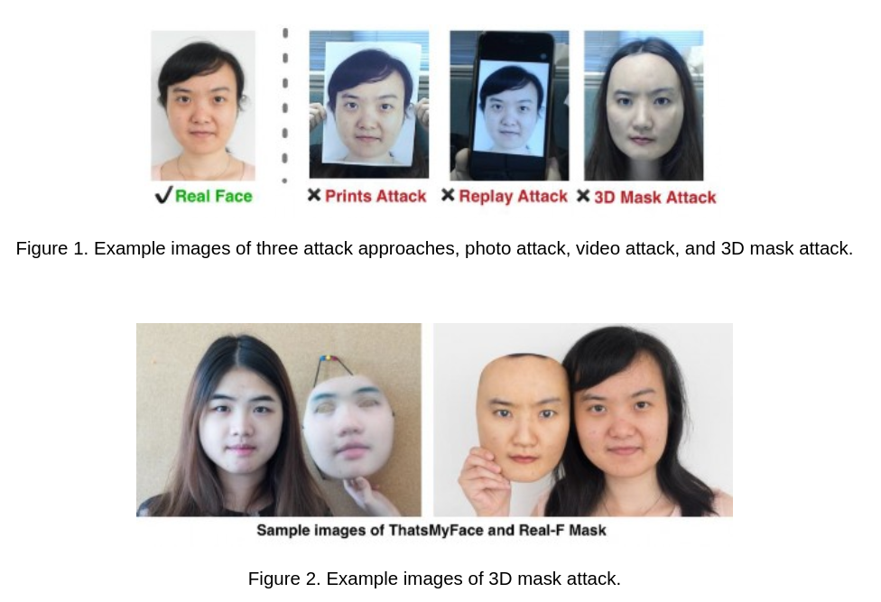
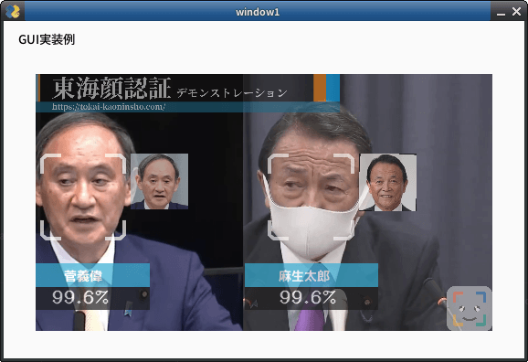

# 防犯カメラの動体検知を実装する②
## はじめに
首都圏を中心に強盗事件が多くなり、防犯カメラを購入される世帯が増えているそうです。

そこでこのシリーズでは、防犯カメラに必要な技術、具体的には動体検知に関する技術の解説と実装に取り組みました。

この記事は[防犯カメラの動体検知を実装する①](https://zenn.dev/ykesamaru/articles/6fa5bf4cfc38b6)の第二弾となります。

防犯カメラの動体検知を実装する①では、枯れた技術（Contour Detection with Area Filtering）である画像処理を用いて、ラズベリーパイでも動作可能な動体検知システムを構築しました。

動体検知機能とは主に以下の3つの機能をカバーしています。

1. 画面上のピクセルの変化をどのように感知するか「検出方法」
2. 動体検知の感度を調整可能な「感度調整」
3. 動体検知の対象となる領域（検知範囲）を指定する「マスキング」

この記事では、最新のAI技術を用いて動体検知を行います。具体的にはDAMO-YOLOについて解説・実装していきます。上記の1~3はカバーしません。


## 動作環境
```bash
(venv) user@user:~/ドキュメント/Motion_Detection$ inxi -SG --filter
System:
  Kernel: 6.8.0-48-generic x86_64 bits: 64 Desktop: GNOME 42.9
    Distro: Ubuntu 22.04.5 LTS (Jammy Jellyfish)
Graphics:
  Device-1: NVIDIA TU116 [GeForce GTX 1660 Ti] driver: nvidia v: 555.42.06
  Display: x11 server: X.Org v: 1.21.1.4 driver: X: loaded: nvidia
    unloaded: fbdev,modesetting,nouveau,vesa gpu: nvidia
    resolution: 2560x1440~60Hz
  OpenGL: renderer: NVIDIA GeForce GTX 1660 Ti/PCIe/SSE2
    v: 4.6.0 NVIDIA 555.42.06

(venv) user@user:~/ドキュメント/Motion_Detection$ python -V
Python 3.10.12

```


### 入力用動画ファイル
[「コラー！」で追い払う…住人は侵入者による被害をなぜ食い止められたのか 専門家が勧める“攻めの防犯”](https://www.youtube.com/watch?v=ZtQw5E3PA5c)

https://www.youtube.com/watch?v=ZtQw5E3PA5c

上記動画をinput.mp4としました。

## DAMO-YOLOについて
これまでわたしの記事ではいくつかの人体検知について記事にしてきました。
- [人物抽出のためのコード比較その①: OpenCV, MediaPipe, DeepLabV3](https://zenn.dev/ykesamaru/articles/e0380990465d34)
- [人物抽出のためのコード比較その②: YOLOv5, SORT](https://zenn.dev/ykesamaru/articles/6cb451f8fd1740)
- [人物抽出のためのコード比較その③: Deep OC-SORT](https://zenn.dev/ykesamaru/articles/36ff6507616e9b)
- [人物抽出のためのコード比較その④: DBSCAN, SSD](https://zenn.dev/ykesamaru/articles/4084a7074f3fe2)
- [人物抽出のためのコード比較その④-2: GPUを使ったSSD](https://zenn.dev/ykesamaru/articles/19254239bd3a6a)

上記それぞれを実際に実装した感想として、`YOLOv5`の性能が若干良いと感じました。

しかしながら`YOLOv5`はライセンス的に使い勝手がよくありません。

以下に、主要なYOLO系モデルとそのライセンス情報をまとめます。

| モデル名     | 公開年 | ライセンス | 商用利用可否 | リポジトリURL |
|--------------|--------|------------|--------------|----------------|
| YOLOv5       | 2020   | GPL        | 不可         | [https://github.com/ultralytics/yolov5](https://github.com/ultralytics/yolov5) |
| YOLOv6       | 2022   | GPL        | 不可         | [https://github.com/meituan/YOLOv6](https://github.com/meituan/YOLOv6) |
| YOLOv7       | 2022   | GPL        | 不可         | [https://github.com/WongKinYiu/yolov7](https://github.com/WongKinYiu/yolov7) |
| YOLOv8       | 2023   | AGPL       | 不可         | [https://github.com/ultralytics/ultralytics](https://github.com/ultralytics/ultralytics) |
| YOLOX        | 2021   | Apache 2.0 | 可能         | [https://github.com/Megvii-BaseDetection/YOLOX](https://github.com/Megvii-BaseDetection/YOLOX) |
| PP-YOLOE     | 2022   | Apache 2.0 | 可能         | [https://github.com/PaddlePaddle/PaddleDetection](https://github.com/PaddlePaddle/PaddleDetection) |
| DAMO-YOLO    | 2023   | Apache 2.0 | 可能         | [https://github.com/tinyvision/DAMO-YOLO](https://github.com/tinyvision/DAMO-YOLO) |
| YOLO-NAS     | 2023   | カスタム   | 要確認       | [https://github.com/Deci-AI/super-gradients](https://github.com/Deci-AI/super-gradients) |

最も新しく、かつライセンス的に良いのは`DAMO-YOLO`であることがわかりました。

`DAMO-YOLO`は一般的な物体検出モデルであり、人体の動体検知に特化しているわけではありませんが、防犯カメラに十分使えそうです。
またカスタムデータセットを作成してモデルのファインチューニングも可能です。たとえば手にバールを持っている人物だけを検知する、なんてことも可能です。

## 実装
### リポジトリ
DAMO-YOLO
https://github.com/tinyvision/DAMO-YOLO?tab=readme-ov-file

### 学習済みモデルの選定
わたしの環境、すなわちGTX 1660 Ti（6GB VRAM）環境でDAMO-YOLOを実行するため、学習済みモデルの選定を行います。

DAMO-YOLOには、以下のようなモデルが提供されています。

| モデル名           | パラメータ数 | 推論速度 (ms) | COCO AP (%) |
|--------------------|--------------|---------------|-------------|
| DAMO-YOLO-T        | 4.7M         | 2.8           | 40.0        |
| DAMO-YOLO-S        | 8.7M         | 3.8           | 43.0        |
| DAMO-YOLO-M        | 25.5M        | 5.6           | 46.8        |
| DAMO-YOLO-L        | 43.5M        | 7.6           | 49.0        |
| DAMO-YOLO-X        | 64.5M        | 9.8           | 50.0        |

DAMO-YOLO-Tがパラメータ数が少なく推論速度も速いので採用します。

### 実行環境構築

#### DAMO-YOLOのリポジトリをクローン
```bash
git clone https://github.com/tinyvision/DAMO-YOLO.git
cd DAMO-YOLO
```

#### Python仮想環境
今回は`DAMO-YOLO`ディレクトリ内に仮想環境を作成します。
```bash
python3 -m venv ./
```

#### 依存ライブラリのインストール
インストールにはしばらく時間がかかります。
```bash
pip install -r requirements.txt
pip install onnx onnx-simplifier onnxruntime
```

#### モジュールのインストール
DAMO-YOLOのディレクトリ内で以下のコマンドを実行し、必要なモジュールをインストールします。
`ModuleNotFoundError`が発生する場合は`damo`モジュールが仮想環境内にインストールされていない、ということなので、この処理が必要です。
```bash
pip install -e .
```

#### 学習済みモデルのダウンロード
```bash
mkdir -p pretrained_models
wget https://idstcv.oss-cn-zhangjiakou.aliyuncs.com/DAMO-YOLO/release_model/clean_model_0317/damoyolo_tinynasL20_T_420.pth -P pretrained_models/
```

#### オプションの確認
```bash
(venv) user@user:~/ドキュメント/Motion_Detection/DAMO-YOLO$ python tools/demo.py --help
usage: DAMO-YOLO Demo [-h] [-f CONFIG_FILE] [-p PATH] [--camid CAMID] [--engine ENGINE] [--device DEVICE] [--output_dir OUTPUT_DIR] [--conf CONF] [--infer_size INFER_SIZE [INFER_SIZE ...]]
                      [--end2end] [--save_result SAVE_RESULT]
                      input_type

positional arguments:
  input_type            input type, support [image, video, camera]

options:
  -h, --help            show this help message and exit
  -f CONFIG_FILE, --config_file CONFIG_FILE
                        pls input your config file
  -p PATH, --path PATH  path to image or video
  --camid CAMID         camera id, necessary when input_type is camera
  --engine ENGINE       engine for inference
  --device DEVICE       device used to inference
  --output_dir OUTPUT_DIR
                        where to save inference results
  --conf CONF           conf of visualization
  --infer_size INFER_SIZE [INFER_SIZE ...]
                        test img size
  --end2end             trt engine with nms
  --save_result SAVE_RESULT
                        whether save visualization results
```

#### OpenCVのエラー対処
OpenCV 4.9.0以降、Pythonでの動作においてNumPy配列が読み取り専用（readonly）として扱われる場合、`cv2.rectangle`や`cv2.circle`などの描画関数を使用するとエラーが発生するようになりました。

```bash
cv2.error: OpenCV(4.10.0) :-1: error: (-5:Bad argument) in function 'rectangle'
> Overload resolution failed:
>  - img marked as output argument, but provided NumPy array marked as readonly
>  - Expected Ptr<cv::UMat> for argument 'img'
```

これはこれらの関数が入力画像を直接変更しようとするため、読み取り専用の配列では操作が許可されないためです。

この変更を知らなかったため、ハマりました。

この変更は、[OpenCVの公式GitHubリポジトリのIssue](https://github.com/opencv/opencv/issues/24522)でも報告されています。

これを解決するため、以下のようにNumPy配列を連続したメモリブロックとしてコピーし、書き込み可能な状態にする必要があります。

```python
import numpy as np

# imgが読み取り専用のNumPy配列である場合
img = np.ascontiguousarray(img).copy()
```

具体的には`damo/utils/visualize.py`内の`vis関数`で、画像配列をコピーしてから処理するように変更します。

```diff: damo/utils/visualize.py
def vis(img, boxes, scores, cls_ids, conf=0.5, class_names=None):

+    # OpenCVでエラーが出ないように、imgを連続メモリとして扱えるようにする
+    img = np.ascontiguousarray(img).copy()

    for i in range(len(boxes)):
```

これで`img`は書き込み可能な配列となり、OpenCVの描画関数を正常に使用できるようになります。

#### 実行対象画像


#### 実行
#### 画像ファイル処理
```bash
(DAMO-YOLO) user@user:~/ドキュメント/Motion_Detection_YOLO/DAMO-YOLO$ python tools/demo.py image   -f ./configs/damoyolo_tinynasL20_T.py   --engine pretrained_models/damoyolo_tinynasL20_T_420.pth   --path assets/input.jpg   --conf 0.6   --save_result True   --device cpu   --infer_size 640 640

Inference with torch engine!
/home/user/ドキュメント/Motion_Detection_YOLO/DAMO-YOLO/tools/demo.py:75: FutureWarning: You are using `torch.load` with `weights_only=False` (the current default value), which uses the default pickle module implicitly. It is possible to construct malicious pickle data which will execute arbitrary code during unpickling (See https://github.com/pytorch/pytorch/blob/main/SECURITY.md#untrusted-models for more details). In a future release, the default value for `weights_only` will be flipped to `True`. This limits the functions that could be executed during unpickling. Arbitrary objects will no longer be allowed to be loaded via this mode unless they are explicitly allowlisted by the user via `torch.serialization.add_safe_globals`. We recommend you start setting `weights_only=True` for any use case where you don't have full control of the loaded file. Please open an issue on GitHub for any issues related to this experimental feature.
  ckpt = torch.load(self.ckpt_path, map_location=self.device)
save visualization results at ./demo/dog.jpg
```


#### 動画ファイル処理
`DAMO-YOLO`の強みはリアルタイム性です。ここでは用意したmp4ファイルを入力として`demo.py`に処理を投げます。

#### 一括処理
```bash
python tools/demo.py video \
  -f ./configs/damoyolo_tinynasL20_T.py \
  --engine pretrained_models/damoyolo_tinynasL20_T_420.pth \
  --path assets/input_1.mp4 \
  --conf 0.3 \
  --save_result True \
  --device cuda \
  --infer_size 640 640
```

この方法で`demo.py`を動作させると`demo/`ディレクトリに処理済みの動画ファイルが作成されます。

#### リアルタイム処理
`demo.py`はリアルタイム処理を想定した処理が書かれていますが、`argparse`モジュールのブール型引数の扱いに誤りがあるため期待通りの動作になりません。[^1]
[^1]: （このようなリポジトリにありがち。学習済みモデルの`coming soon!`は絶対に追加されないし、メインの処理以外はバグで動かない。）

`argparse`モジュールのブール型引数の扱いが難しいのは、文字列の引数（例: `"True"` や `"False"`）をそのまま渡しても、`argparse`がそれをブール型に変換してくれないからです。

`argparse`では、ブール型の引数を扱うために、`action='store_true'` や `action='store_false'` を使う方法が推奨されています。この方法であれば引数が指定されているかどうかに応じて、`True` または `False` を簡単に設定できます。

```python
parser.add_argument('--save_result', action='store_true', help='whether to save visualization results')
parser.add_argument('--no_save_result', action='store_false', dest='save_result', help='do not save visualization results')
```

- `--save_result` が指定されていると `args.save_result` が `True` になります。
- `--no_save_result` が指定されていると `args.save_result` が `False` になります。

そこで`demo.py`を以下のように修正します。

```diff
- parser.add_argument('--save_result',
-                     default=True,
-                     type=bool,
-                     help='whether save visualization results')

+ parser.add_argument('--save_result',
+                     action='store_true',
+                     help='whether to save visualization results')
+ parser.add_argument('--no_save_result',
+                     action='store_false',
+                     dest='save_result',
+                     help='do not save visualization results')
```
```diff
    elif input_type == 'video' or input_type == 'camera':
        cap = cv2.VideoCapture(args.path if input_type == 'video' else args.camid)
        width = cap.get(cv2.CAP_PROP_FRAME_WIDTH)  # float
        height = cap.get(cv2.CAP_PROP_FRAME_HEIGHT)  # float
        fps = cap.get(cv2.CAP_PROP_FPS)
-       if args.save_result:
-           save_path = os.path.join(args.output_dir, os.path.basename(args.path))
-           print(f'inference result will be saved at {save_path}')
-           vid_writer = cv2.VideoWriter(
-               save_path, cv2.VideoWriter_fourcc(*"mp4v"),
-               fps, (int(width), int(height)))
        while True:
            ret_val, frame = cap.read()
            if ret_val:
                bboxes, scores, cls_inds = infer_engine.forward(frame)
                result_frame = infer_engine.visualize(frame, bboxes, scores, cls_inds, conf=args.conf, save_result=False)
-               if args.save_result:
-                   vid_writer.write(result_frame)
-               else:
-                   cv2.namedWindow("DAMO-YOLO", cv2.WINDOW_NORMAL)
-                   cv2.imshow("DAMO-YOLO", result_frame)
                ch = cv2.waitKey(1)
                if ch == 27 or ch == ord("q") or ch == ord("Q"):
                    break
            else:
                break

+       width = cap.get(cv2.CAP_PROP_FRAME_WIDTH)
+       height = cap.get(cv2.CAP_PROP_FRAME_HEIGHT)
+       fps = cap.get(cv2.CAP_PROP_FPS)

+       # 保存が有効な場合のみVideoWriterを作成し、メッセージを表示
+       if args.save_result:
+           save_path = os.path.join(args.output_dir, os.path.basename(args.path))
+           print(f'inference result will be saved at {save_path}')
+           vid_writer = cv2.VideoWriter(
+               save_path, cv2.VideoWriter_fourcc(*"mp4v"),
+               fps, (int(width), int(height))
+           )

+       while True:
+           ret_val, frame = cap.read()
+           if not ret_val:
+               break

+           bboxes, scores, cls_inds = infer_engine.forward(frame)
+           result_frame = infer_engine.visualize(
+               frame, bboxes, scores, cls_inds, conf=args.conf, save_result=False
+           )

+           # 保存が有効な場合のみフレームを保存、そうでない場合はウィンドウに表示
+           if args.save_result:
+               vid_writer.write(result_frame)
+           else:
+               cv2.namedWindow("DAMO-YOLO", cv2.WINDOW_NORMAL)
+               cv2.imshow("DAMO-YOLO", result_frame)

+           ch = cv2.waitKey(1)
+           if ch == 27 or ch == ord("q") or ch == ord("Q"):
+               break
```

そして以下のように引数を指定して呼び出します。（VSCodeのlaunch.json）
```json
{
    "name": "demo.py",
    "type": "debugpy",
    "request": "launch",
    "program": "/home/user/ドキュメント/Motion_Detection_YOLO/DAMO-YOLO/tools/demo.py",
    "python": "/home/user/ドキュメント/Motion_Detection_YOLO/DAMO-YOLO/bin/python3",
    "cwd": "/home/user/ドキュメント/Motion_Detection_YOLO/DAMO-YOLO",
    "console": "integratedTerminal",
    "args": [
        "video",
        "-f", "./configs/damoyolo_tinynasL20_T.py",
        "--engine", "pretrained_models/damoyolo_tinynasL20_T_420.pth",
        "--path", "assets/input_1.mp4",
        "--conf", "0.5",
        "--no_save_result",
        "--device", "cuda",
        "--infer_size", "640", "640"
    ]
}
```
## 出力結果
### 一括処理
https://youtu.be/upXQ8RjYVH4

### リアルタイム処理
https://youtu.be/QUjVKslHcMQ


## さいごに
`DAMO-YOLO`では以下の分類が可能とされています。
```bash
「人」、「自転車」、「車」、「バイク」、「飛行機」、「バス」、「電車」、「トラック」、「船」、「信号機」、「消火栓」、「一時停止の標識」 、「パーキングメーター」、「ベンチ」、「鳥」、「猫」、「犬」、「馬」、「羊」、「牛」、「象」、「熊」、「シマウマ」、「キリン」、「バックパック」、「傘」、「ハンドバッグ」、「ネクタイ」、「スーツケース」、「フリスビー」、「スキー板」、「スノーボード」、「スポーツボール」、「凧」、「野球バット」、「野球グローブ」 、「スケートボード」、「サーフボード」、「テニスラケット」、「ボトル」、「ワイングラス」、「カップ」、「フォーク」、「ナイフ」、「スプーン」、「ボウル」、「バナナ」、「リンゴ」 、「サンドイッチ」、「オレンジ」、「ブロッコリー」、「にんじん」、「ホットドッグ」、「ピザ」、「ドーナツ」、「ケーキ」、「椅子」、「ソファ」、「鉢植え」、「ベッド」 、「ダイニング テーブル」、「トイレ」、「テレビ」、「ラップトップ」、「マウス」、「リモコン」、「キーボード」、「携帯電話」、「電子レンジ」、「オーブン」、「トースター」、「シンク」 、「冷蔵庫」、「本」、「時計」、「花瓶」、「ハサミ」、「テディベア」、「ヘアドライヤー」、「歯ブラシ」
```

この内、防犯カメラに必要なのは「人」、「自転車」、「車」、「バイク」でしょう。これらが検知されたらブザーを鳴らす、という処理も簡単に挿入できます。

またその領域だけを画像保存することも可能です。

`DAMO-YOLO`には[産業用の学習済みモデルも配布されています](https://github.com/tinyvision/DAMO-YOLO)。


`DAMO-YOLO`で人物だけを「顔認証」することも可能です。
また、マスクを学習させたモデルと帽子を追加学習させれば「怪しい人」だけを検知することもできます。

流石にIOTデバイスでのリアルタイム処理は無理ですが、処理をPCに投げるかクラウドで対応するなら、まさにイマドキの防犯カメラになりそうですね。

以上です。ありがとうございました。


# 防犯カメラの動体検知を実装する③: なりすまし防止機能の実装
## はじめに
[防犯カメラの動体検知を実装する②](https://zenn.dev/ykesamaru/articles/e0c2db932066bb)では`damo-yolo`を使い人物の検出を行いました。その際、リポジトリにあった`demo.py`をそのまま使用しましたが、この記事ではアプリケーションに組み込める形を作っていきます。

最初に完成したプログラムの出力をみてみましょう。


- 標準出力
  ```bash
  スマホのお姉さん 
           類似度          96.4% 
           座標            (77, 492, 181, 388) 
           時刻                    2024,12,03,09,33,14,628409 
           出力                     
   -------

  物体検出結果:
  物体: person, スコア: 0.88, バウンディングボックス: [117.251564  22.69603  343.45676  734.7988  ]
  物体: cell phone, スコア: 0.53, バウンディングボックス: [221.03716 520.6959  259.49316 670.29706]
  物体: potted plant, スコア: 0.53, バウンディングボックス: [4.2177245e-02 2.9340579e+02 5.6148739e+01 7.3426111e+02]
  物体: laptop, スコア: 0.53, バウンディングボックス: [7.0365340e-01 6.0334821e+02 1.1288249e+02 7.3260529e+02]
    ```

- 元動画：[PIXABAY](https://pixabay.com/ja/videos/%E5%A5%B3%E6%80%A7-%E3%82%B9%E3%83%9E%E3%83%BC%E3%83%88-%E3%83%95%E3%82%A9%E3%83%B3-130647/)

**リアルタイムで顔とスマホの座標が得られると、なにが嬉しいのでしょうか？**

顔認証において、アンチスプーフィング（なりすまし防止）は永遠の課題です。

ディープラーニングを採用したり画像解析を行ったりするわけですが、どのような光源でも変わらない性能（汎化性能）を担保するのは制限があり、完璧なアンチスプーフィングは存在しません。

- [顔なりすましの微細な痕跡を可視化！なりすましの痕跡を応用したFace Anti-spoofingモデル「STDN」によって高精度を達成！ ](https://ai-scholar.tech/articles/face-recognition/face-anti-spoofing-spoof-trace?utm_source=chatgpt.com)
- [新しい畳み込み演算CDCによる堅牢なFace Anti-spoofing（なりすまし防止）モデル ](https://ai-scholar.tech/articles/face-recognition/cdcn-for-face-anfi-spoofing?utm_source=chatgpt.com)
- [顔認証の時、本人がその場にいるか写真かを判定する技術](https://www.fujitsu.com/jp/about/research/techguide/list/antispoofing/?utm_source=chatgpt.com)



しかしながら、**必ずしも新規技術を開発する必要はない**のではないかとも思います。というのも、紙にプリントされた顔の場合、紙を持つ手や紙そのものを検出できればいいわけです。あるいはプリントされた顔画像は目の動きや顔の角度が不変なので、それを検出する方法は複数あり、実際に実装した例を記事としてだしてます。

- [まばたきを検知するPythonコードの解説](https://zenn.dev/ykesamaru/articles/f10804a8fcc81d)
- [スマホの画面注視認識機能を簡易実装する](https://zenn.dev/ykesamaru/articles/6e2098dbef148e)
- [頭部姿勢推定を簡易実装する](https://zenn.dev/ykesamaru/articles/025b0eabf24e20)


それではスマホに写した顔画像や顔動画はどうでしょうか？
この場合はスマホそれ自体を検出できればいいわけです。**スマホの座標と顔の座標を計算し、スマホ座標の内側に顔座標があれば、それはスマホで表示した顔である**、と分かるわけです。


この記事では**顔とスマートフォンを検出し、座標を返すプログラム**を考えていきます。

具体的には、`DAMO-YOLO`技術を`FACE01`で扱えるコードとして完成させます。

## FACE01とは
FACE01とはコミュニティライセンスの顔認証フレームワークです。日本人専用の顔学習済みモデルが同梱されています。

https://github.com/yKesamaru/FACE01_DEV




FACE01では、内部のジェネレーターによって、入力動画の1フレームずつに様々な情報が付与されたオブジェクトが取り出せます。顔の座標、信頼度、類似度、人名ほか、色々な情報が次々と得られるわけです。

FACE01のジェネレーターは以下のように定義されます。
```python
# ジェネレータを生成
gen = Core().common_process()
# ジェネレータオブジェクトからフレームごとの情報を取得
for i in range(0, 100):
    frame_data = gen.__next__()
```
この中には`numpy`形式の画像そのものも含まれるわけですが、これを`DAMO-YOLO`の学習済みモデルに渡して、何が写っていたか情報をえる、という方法をとります。

`demo.py`を参考に、`Inferクラス`としてモジュール化したスクリプトを`base.py`として作成しました。
```python: base.py
"""
Summary:
    このスクリプトは、DAMO-YOLOを使用して画像内の物体を検出するプログラムです。
    指定された画像をモデルに入力し、検出された物体のクラス、スコア、バウンディングボックスを出力します。
    スコアが0.5以上の検出結果のみを表示します。
"""

import numpy as np
import torch
from face01lib.damo_yolo.damo_internal.config.base import parse_config
from face01lib.damo_yolo.damo_internal.detectors.detector import build_local_model
from face01lib.damo_yolo.damo_internal.structures.bounding_box import BoxList
from face01lib.damo_yolo.damo_internal.utils import postprocess
from face01lib.damo_yolo.damo_internal.utils.demo_utils import transform_img
from PIL import Image

# クラスIDからクラス名へのマッピング
COCO_CLASSES = [
    "person", "bicycle", "car", "motorcycle", "airplane", "bus", "train", "truck", "boat", "traffic light",
    "fire hydrant", "stop sign", "parking meter", "bench", "bird", "cat", "dog", "horse", "sheep", "cow",
    "elephant", "bear", "zebra", "giraffe", "backpack", "umbrella", "handbag", "tie", "suitcase", "frisbee",
    "skis", "snowboard", "sports ball", "kite", "baseball bat", "baseball glove", "skateboard", "surfboard", "tennis racket", "bottle",
    "wine glass", "cup", "fork", "knife", "spoon", "bowl", "banana", "apple", "sandwich", "orange",
    "broccoli", "carrot", "hot dog", "pizza", "donut", "cake", "chair", "couch", "potted plant", "bed",
    "dining table", "toilet", "TV", "laptop", "mouse", "remote", "keyboard", "cell phone", "microwave", "oven",
    "toaster", "sink", "refrigerator", "book", "clock", "vase", "scissors", "teddy bear", "hair drier", "toothbrush"
]


class Infer:
    """
    画像内の物体を検出するための推論クラス。

    Attributes:
        config: モデルの設定ファイル。
        ckpt_path: 学習済みモデルのチェックポイントのパス。
        infer_size: 推論時の画像サイズ（デフォルトは640x640）。
        device: 推論を行うデバイス（デフォルトはCUDA）。
        engine_type: 推論に使用するエンジンタイプ（torch、onnx、tensorRTのいずれか）。
    """
    def __init__(self, config, ckpt_path, infer_size=[640, 640], device='cuda', engine_type='torch'):
        """
        初期化メソッド。

        Args:
            config: モデルの設定ファイル。
            ckpt_path: 学習済みモデルのチェックポイントのパス。
            infer_size: 推論時の画像サイズ（デフォルトは640x640）。
            device: 推論を行うデバイス（デフォルトはCUDA）。
            engine_type: 推論に使用するエンジンタイプ（torch、onnx、tensorRTのいずれか）。
        """
        self.device = device if torch.cuda.is_available() else 'cpu'
        self.config = config
        self.infer_size = infer_size
        self.engine_type = engine_type
        self.model = self._build_model(ckpt_path)

    def _build_model(self, ckpt_path):
        """
        モデルを構築します。

        Args:
            ckpt_path: 学習済みモデルのチェックポイントのパス。

        Returns:
            構築されたモデル。
        """
        print(f'{self.engine_type}エンジンを使用してモデルを構築中...')
        if self.engine_type == 'torch':
            model = build_local_model(self.config, ckpt=ckpt_path, device=self.device)
            # ckpt = torch.load(ckpt_path, map_location=self.device)
            ckpt = torch.load(ckpt_path, map_location=self.device, weights_only=True)  # モデルの重み（パラメータ）のみを使用し、その他のオブジェクト（トレーニングの状態やカスタムクラスのインスタンスなど）は読み込まない。標準出力の警告文回避。
            model.load_state_dict(ckpt['model'], strict=True)
            model.eval()
        elif self.engine_type == 'onnx':
            raise NotImplementedError("この例ではONNXエンジンは未実装です。")
        elif self.engine_type == 'tensorRT':
            raise NotImplementedError("この例ではTensorRTエンジンは未実装です。")
        else:
            raise ValueError(f"サポートされていないエンジンタイプです: {self.engine_type}")
        return model

    def preprocess(self, image_path):
        """
        画像を前処理します。

        Args:
            image_path: 処理対象の画像ファイルのパス。

        Returns:
            前処理後の画像テンソルと元画像の形状。
        """
        origin_img = np.asarray(Image.open(image_path).convert('RGB'))
        img = transform_img(origin_img, 0, **self.config.test.augment.transform, infer_size=self.infer_size)
        img = img.tensors.to(self.device)
        return img, origin_img.shape[:2]

    def postprocess(self, preds, origin_shape):
        """
        推論結果を後処理します。

        Args:
            preds: モデルの推論結果。
            origin_shape: 元画像の形状。

        Returns:
            バウンディングボックス、スコア、クラスインデックスのリスト。
        """
        if self.engine_type == 'torch':
            output = preds
        elif self.engine_type == 'onnx':
            scores = torch.Tensor(preds[0])
            bboxes = torch.Tensor(preds[1])
            output = postprocess(scores, bboxes,
                                 self.config.model.head.num_classes,
                                 self.config.model.head.nms_conf_thre,
                                 self.config.model.head.nms_iou_thre)
        else:
            raise ValueError(f"サポートされていないエンジンタイプです: {self.engine_type}")

        if len(output) > 0:
            output = output[0].resize(origin_shape)
            bboxes = output.bbox.cpu().numpy()
            scores = output.get_field('scores').cpu().numpy()
            cls_inds = output.get_field('labels').cpu().numpy()
        else:
            bboxes, scores, cls_inds = [], [], []

        return bboxes, scores, cls_inds

    def forward(self, image):
        """
        画像を推論します。

        Args:
            image: 推論対象の画像（ファイルパスまたは numpy.ndarray）。

        Returns:
            推論後のバウンディングボックス、スコア、クラスインデックスのリスト。
        """
        with torch.no_grad():  # 推論時に勾配追跡を無効化
            if isinstance(image, str):  # ファイルパスの場合
                origin_img = np.asarray(Image.open(image).convert('RGB'))
            elif isinstance(image, np.ndarray):  # numpy.ndarray の場合
                origin_img = image
            else:
                raise ValueError("`image` はファイルパスまたは numpy.ndarray でなければなりません。")

            # 前処理
            img = transform_img(origin_img, 0, **self.config.test.augment.transform, infer_size=self.infer_size)
            img = img.tensors.to(self.device)

            # 推論
            preds = self.model(img)

            # 後処理
            return self.postprocess(preds, origin_img.shape[:2])

```

ディレクトリ構造は以下のようになっています。`DAMO-YOLO`由来のファイルのすべての`import文`を、矛盾の無いように書き換えてあります。

```bash
FACE01_DEV/face01lib/damo_yolo$
./
├── __init__.py
├── __pycache__/
│   ├── __init__.cpython-310.pyc
│   └── base.cpython-310.pyc
├── assets/
│   ├── dog.jpg
│   ├── input.png
│   └── input_1.mp4
├── base.py
├── configs/
│   ├── __pycache__/
│   │   └── damoyolo_tinynasL20_T.cpython-310.pyc
│   └── damoyolo_tinynasL20_T.py
├── damo_internal/
│   ├── __init__.py
│   ├── __pycache__/
│   │   └── __init__.cpython-310.pyc
│   ├── apis/
│   │   ├── __init__.py
│   │   ├── __pycache__/
│   │   ├── detector_inference.py
│   │   ├── detector_inference_trt.py
│   │   └── detector_trainer.py
│   ├── augmentations/
│   │   ├── __init__.py
│   │   ├── __pycache__/
│   │   ├── box_level_augs/
│   │   └── scale_aware_aug.py
│   ├── base_models/
│   │   ├── __init__.py
│   │   ├── __pycache__/
│   │   ├── backbones/
│   │   ├── core/
│   │   ├── heads/
│   │   ├── losses/
│   │   └── necks/
│   ├── config/
│   │   ├── __init__.py
│   │   ├── __pycache__/
│   │   ├── augmentations.py
│   │   ├── base.py
│   │   └── paths_catalog.py
│   ├── dataset/
│   │   ├── __init__.py
│   │   ├── __pycache__/
│   │   ├── build.py
│   │   ├── collate_batch.py
│   │   ├── datasets/
│   │   ├── samplers/
│   │   └── transforms/
│   ├── detectors/
│   │   ├── __pycache__/
│   │   └── detector.py
│   ├── structures/
│   │   ├── __init__.py
│   │   ├── __pycache__/
│   │   ├── bounding_box.py
│   │   ├── boxlist_ops.py
│   │   └── image_list.py
│   └── utils/
│       ├── __init__.py
│       ├── __pycache__/
│       ├── boxes.py
│       ├── checkpoint.py
│       ├── debug_utils.py
│       ├── demo_utils.py
│       ├── dist.py
│       ├── imports.py
│       ├── logger.py
│       ├── metric.py
│       ├── model_utils.py
│       ├── timer.py
│       └── visualize.py
├── pretrained_models/
│   └── damoyolo_tinynasL20_T_420.pth
└── requirements.txt

32 directories, 44 files
```

FACE01側では、`display_GUI_window_JAPANESE_FACE_V1_with_YOLO.py`から`base.py`の`Inferクラス`を呼び出して使えるようにしました。

```python: display_GUI_window_JAPANESE_FACE_V1_with_YOLO.py
"""
顔画像と物体を検出し、回転・クロップ・表示するウィンドウアプリケーション.

Summary:
    このプログラムは、顔認識モデルとDAMO-YOLO物体検出モデルを使用して、
    動画フレーム内の顔と物体を検出し、それらの情報をリアルタイムで表示します。
    GUIウィンドウ上に処理結果を表示し、詳細情報をターミナルに出力します。

Usage:
    .. code-block:: bash

        python display_GUI_window_JAPANESE_FACE_V1_with_YOLO.py <exec_times>

Features:
    - 顔認識と物体検出をリアルタイムで実行
    - 検出結果（類似度、座標、物体名など）をターミナルに表示
    - GUIウィンドウ上で処理結果を更新表示
    - 処理回数または検出件数に応じてプログラムを終了

Example:
    .. code-block:: bash

        python display_GUI_window_JAPANESE_FACE_V1_with_YOLO.py

Result:
    - GUIウィンドウで処理結果をリアルタイム表示
    - ターミナルに検出データの詳細を出力
"""
import sys
import os

dir: str = os.path.dirname(__file__)
parent_dir, _ = os.path.split(dir)
sys.path.append(parent_dir)

import tkinter as tk
from tkinter import Button, Label
from typing import Dict

import cv2
from PIL import Image, ImageTk

from face01lib.Core import Core
from face01lib.Initialize import Initialize
from face01lib.damo_yolo.base import Infer, COCO_CLASSES  # base.pyをモジュールとして使用
from face01lib.damo_yolo.damo_internal.config.base import parse_config


def main(exec_times: int = 50) -> None:
    """
    ウィンドウを表示し、顔と物体を検出するメイン関数.

    Args:
        exec_times (int, optional): 処理を実行する回数. デフォルトは50回.

    Returns:
        None
    """
    # 初期化処理
    CONFIG: Dict = Initialize('JAPANESE_FACE_V1_MODEL_GUI').initialize()

    # DAMO-YOLOモデルの設定
    config_file = "face01lib/damo_yolo/configs/damoyolo_tinynasL20_T.py"
    ckpt_path = "face01lib/damo_yolo/pretrained_models/damoyolo_tinynasL20_T_420.pth"
    # 設定ファイルを解析してconfigを作成
    config = parse_config(config_file)
    damo_infer = Infer(config=config, ckpt_path=ckpt_path)

    # tkinterウィンドウの作成
    root = tk.Tk()
    root.title('FACE01 example with JAPANESE_FACE_V1 and DAMO-YOLO')
    root.geometry('800x600')

    # 画像を表示するためのラベル
    display_label = Label(root)
    display_label.pack()

    # 終了ボタンの設定
    def terminate():
        """ウィンドウを終了する関数."""
        root.destroy()

    terminate_button = Button(root, text="terminate", command=terminate)
    terminate_button.pack(pady=10)

    # ジェネレータを生成
    gen = Core().common_process(CONFIG)

    try:
        # カウント変数を初期化
        count = 0  # フレーム全体でカウントを維持
        max_count = 200  # 最大回数を設定

        # 'exec_times' 回処理を繰り返す
        for i in range(0, exec_times):
            # ジェネレータオブジェクトから次の値を取得
            frame_datas_array = gen.__next__()

            for frame_datas in frame_datas_array:
                # 顔認識結果をターミナルに出力
                for person_data in frame_datas['person_data_list']:
                    if not person_data['name'] == 'Unknown':
                        print(
                            person_data['name'], "\n",
                            "\t", "類似度\t\t", person_data['percentage_and_symbol'], "\n",
                            "\t", "座標\t\t", person_data['location'], "\n",
                            "\t", "時刻\t\t\t", person_data['date'], "\n",
                            "\t", "出力\t\t\t", person_data['pict'], "\n",
                            "-------\n"
                        )
                    count += 1  # カウントをインクリメント

                    if count >= max_count:  # カウントが最大に達したらループを抜ける
                        raise StopIteration  # 外側のループも終了するために例外を送出

                # DAMO-YOLOで物体検出を実行
                bboxes, scores, cls_inds = damo_infer.forward(frame_datas['img'])

                # 検出結果をターミナルに表示
                print("物体検出結果:")
                for bbox, score, cls_ind in zip(bboxes, scores, cls_inds):
                    if score >= 0.5:  # スコアが0.5以上の物体のみ出力
                        class_name = COCO_CLASSES[int(cls_ind)]  # クラス名を取得
                        print(f"物体: {class_name}, スコア: {score:.2f}, バウンディングボックス: {bbox}")

                # 画像をPIL形式に変換
                img = cv2.cvtColor(frame_datas['img'], cv2.COLOR_BGR2RGB)  # OpenCVのBGRをRGBに変換
                img = Image.fromarray(img)  # OpenCVの画像をPIL画像に変換
                img = ImageTk.PhotoImage(img)  # PIL画像をImageTkに変換

                # 新しい画像でラベルを更新
                display_label.config(image=img)
                display_label.image = img

            # ウィンドウを更新
            root.update_idletasks()
            root.update()

    except StopIteration:
        # 動画の供給が終了、またはカウントが最大に達した場合の処理
        print("処理が完了しました。プログラムを終了します。")
        root.destroy()  # ウィンドウを閉じる
    except Exception as e:
        # その他の予期しないエラーが発生した場合の処理
        print(f"予期しないエラーが発生しました: {e}")
        root.destroy()  # エラーが発生した場合もウィンドウを閉じる
    finally:
        # 終了処理
        print("終了処理を行っています...")


if __name__ == '__main__':
    # メイン関数を呼び出す
    main(exec_times=200)
```

このエグザンプルスクリプトを動作させると、記事冒頭で紹介しているウィンドウがリアルタイムで表示されます。


- 標準出力
  ```bash
  スマホのお姉さん 
           類似度          96.4% 
           座標            (77, 492, 181, 388) 
           時刻                    2024,12,03,09,33,14,628409 
           出力                     
   -------

  物体検出結果:
  物体: person, スコア: 0.88, バウンディングボックス: [117.251564  22.69603  343.45676  734.7988  ]
  物体: cell phone, スコア: 0.53, バウンディングボックス: [221.03716 520.6959  259.49316 670.29706]
  物体: potted plant, スコア: 0.53, バウンディングボックス: [4.2177245e-02 2.9340579e+02 5.6148739e+01 7.3426111e+02]
  物体: laptop, スコア: 0.53, バウンディングボックス: [7.0365340e-01 6.0334821e+02 1.1288249e+02 7.3260529e+02]
    ```

標準出力は1フレームごとの情報が出力され続けます。

さて、この出力を見ると顔の座標とスマホの座標はそれぞれ以下のようになっています。
- 顔：(77, 492, 181, 388)
- スマホ：[221.03716 520.6959  259.49316 670.29706]

**もしスマホの座標の内側に顔の座標が存在したとすれば、それはスマホで表示した顔画像であり、「なりすまし」であると判断できるでしょう。**

## さいごに
YOLO系の中でも`DAMO-YOLO`は使いやすいライセンスであり、また速度と精度のバランスが取れた学習済みモデルを提供しています。FACE01のようにリアルタイム性を重視したアプリケーションにも馴染みやすいと思います。

また追加学習も比較的簡単なことから、**「バールのような物」を持っている人物を検出**なども可能になる拡張性を持っています。

以上です。ありがとうございました。